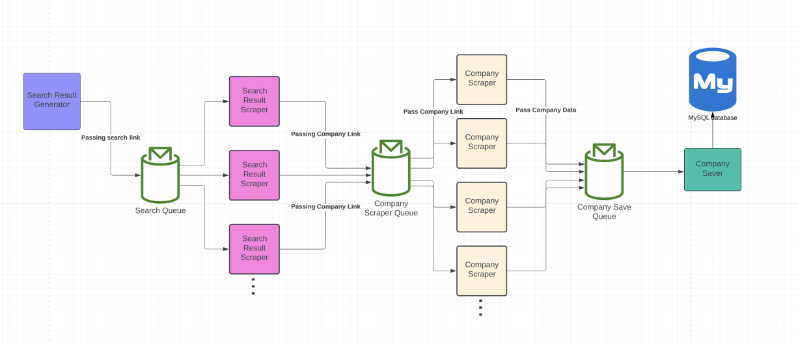

# Company Scraper 🚀

This scraper was built by **China Team** for the Innoscripta Data Competition. Its purpose is to scrape data of Chinese companies from [https://www.gongsi.com.cn](https://gongsi.com.cn/).

## Table of contents

* [How it works](#how-it-works-)
  * [Search page generator](#search-page-generator-)
  * [Search page scraper](#search-page-scraper-)
  * [Company scraper](#company-scraper-)
  * [Company saver](#company-saver-)
* [Installation](#installation)

## How it works? 🤔

This scraper utilizes RabbitMQ for communication between the master and workers, enabling it to be highly scalable.

The system comprises four different types of workers:

* Search page generator
* Search page scraper
* Company scraper
* Company save worker.

## Search page generator 

There is a pagination limit in place for this system. Non-registered users have a limit of 100 pages, while registered users have a limit of 200 pages. 
If a search result contains more than 200 pages, filters must be applied to generate search results with fewer pages.

The search page generator is responsible for generating search pages and writing the links to the "**search\_page**" queue, which is then scraped by the "Search page scraper" worker.

## Search page scraper 

This scraper, scrapes though all pages of the search result and writes company links onto "**company_link**" queue so that "Company scraper" can scrape them. We are not able to scrape more than 200 pages for every search result. 

This is the only scraper which needs authentication. Therefore, there is another worker to generate valid cookies.

> Note: To prevent long queue messages and maintain the performance of the scraper, it is designed to stop when the number of not scraped company links in the queue exceeds a certain threshold. Specifically, the scraper will pause when there are more than 30,000 not scraped links in the queue and resume when the number decreases to a safe level. This ensures that the scraper can continue to operate efficiently without overloading the RabbitMQ message queue.

## Company scraper

The scraper is designed to extract the following types of company data:

* Basic company information, including the company's name, address, phone number, email, website, and other relevant details.
* Detailed company information, including the company's industry, type, size, and other relevant details.
* Branches of the company, including the branch name, person, date, and status.
* Key people associated with the company, such as executives and board members.
* Information about investors who have provided funding to the company.
* Information about shareholders who own stock in the company.
* Annual reports filed by the company which contain financial information and employee count.

> Note: Some companies do not have all of the above information. For example, some companies do not want to disclose their financial information, so they do not have annual reports.

## Company saver 

To prevent simultaneous queries, the scraper utilizes queues to store data in the database. If a company already exists in the database, it will be updated.

---

## Installation

Running the scraper requires both RabbitMQ and MySQL. You can use existing installations or run them using Docker and the `docker-compose.yml` file provided in this repository.

## Requirements

* Python3+ (Tested with 3.11)
* Docker

## How to run?

1. Clone the repository
2. To run the Docker Compose file, navigate to the root folder of the project in your terminal and use the command `docker-compose up -d`. This will start the RabbitMQ and MySQL services in detached mode.
3. To configure the scraper, copy the `config.example.py` file to `config.py` using the command `cp config.example.py config.py`. Then, edit the contents of the `config.py` file to reflect your MySQL and RabbitMQ configurations. For detailed instructions, see [config file explanation](assets/docs/config.md)
4. Install python dependencies using `pip install -r requirements.txt`
5. If you are not using docker, simply import storage/scheme.sql file into database.
6. To run the master script, use the command `python master.py` in your terminal. This will initiate the scraping process and coordinate communication between the various workers.
7. To run the worker script, use the command `python worker.py` in your terminal. This will start the worker process and enable it to receive and process tasks from the RabbitMQ message queue.

**You can run as many workers as you need to scale the scraper. Once you have initiated the master script, you can run workers from any server, and they will be able to communicate with the master process through the RabbitMQ message queue. This enables you to easily scale the scraper to handle larger workloads.**
